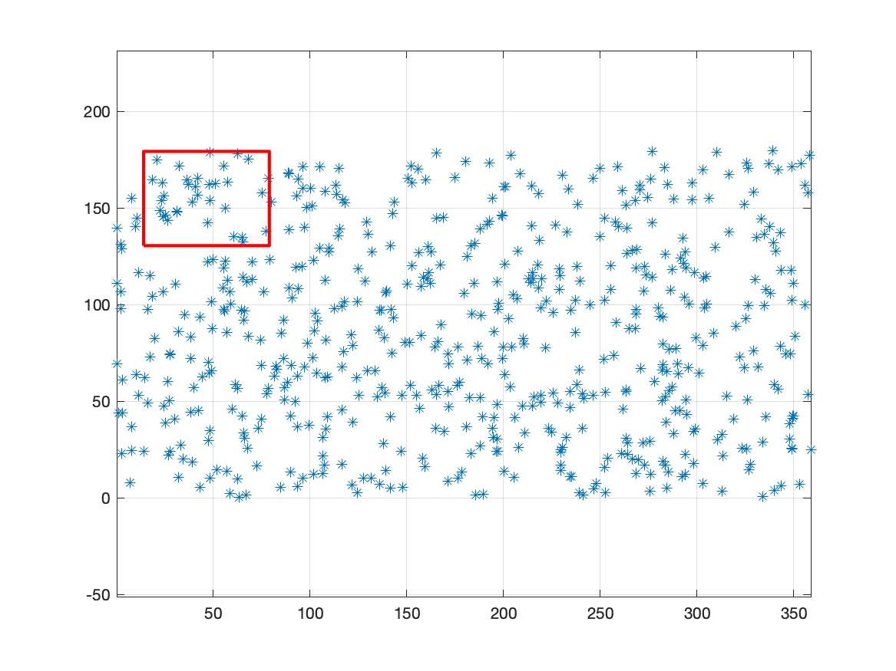
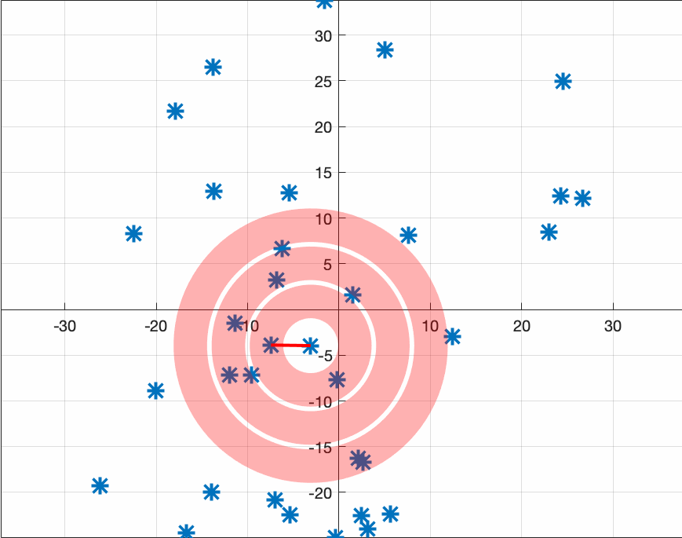
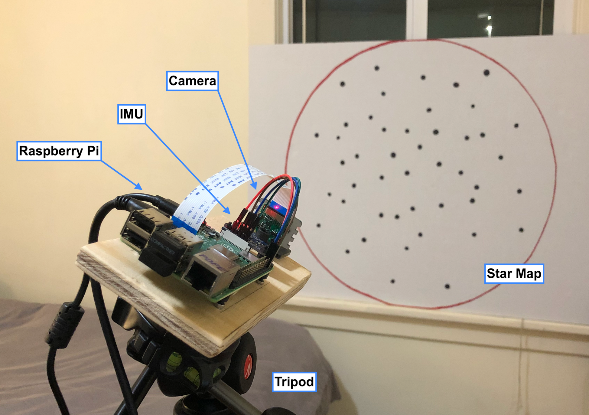
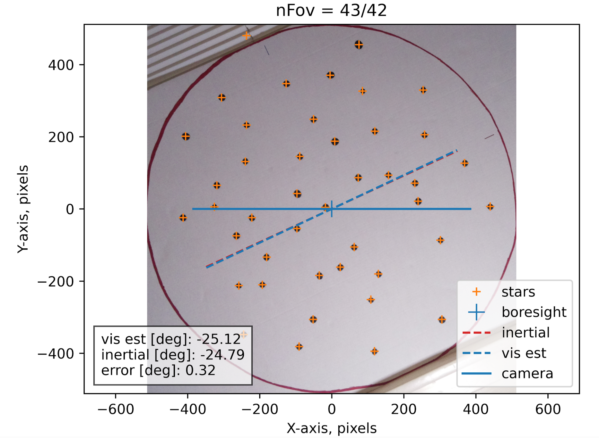
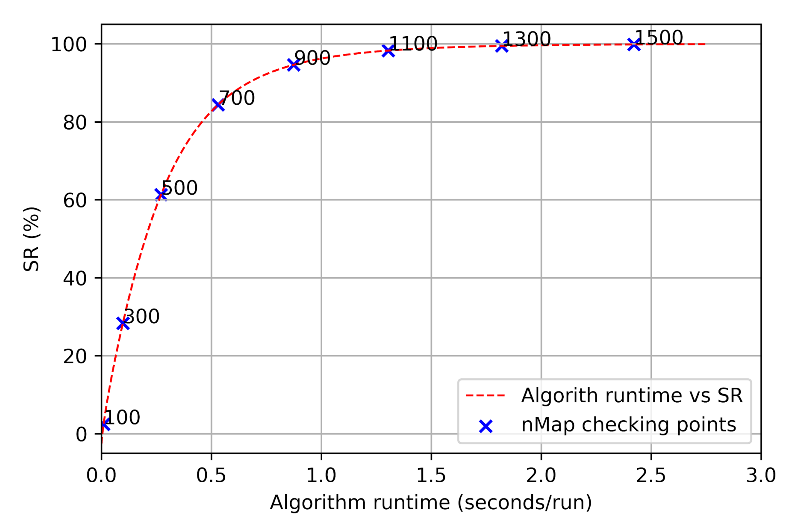

# StarTracker
A POV-free Vision-based Satellite Navigator

>This repo archieves code and artifacts, along with writings, of a A POV-free Vision-based Satellite Navigator project I completed in 2020 with my esteemed colleagues William Pope, Jinhe Xu, and Alex Zhen, at University of Washington William E. Boeing Department of Aeronautics and Astronautics.

